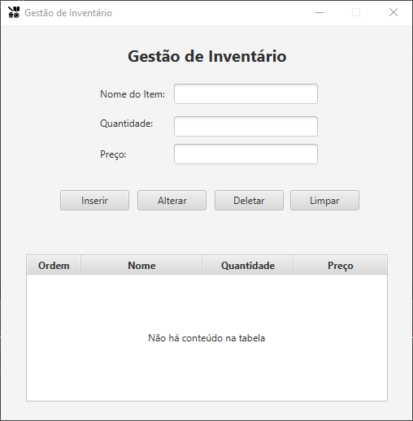
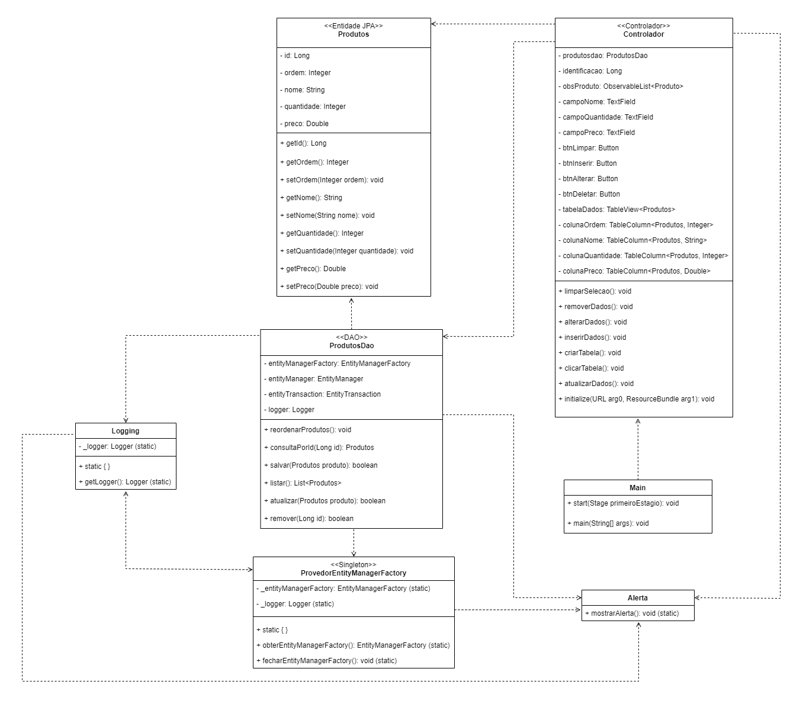

# Gestão de Inventário

[](https://github.com/AirthonSantos/Gestao-Inventario/blob/main/LICENSE)

## Sobre
Esse projeto foi desenvolvido para a disciplina de Programação Orientada a Objetos em Java do curso de Ciência da Computação.

O programa em questão é um CRUD desenvolvido em Java, que utiliza o banco de dados PostgreSQL. Para facilitar a comunicação com o banco de dados, foi empregado o framework Hibernate. Além disso, a aplicação adota o padrão DAO (Data Access Object) e o Singleton. Por fim, visando tornar o programa mais intuitivo, foi criado uma interface gráfica usando o JavaFX.

### Tela principal


O ícone usado foi obtido do site icons8, segue o link: https://icons8.com/icon/pEAInx3HGXxB/crud

### Funcionalidades

Visei tornar o programa o mais intuitivo possível, mas mesmo assim gostaria de explicar sobre suas funcionalidades:

- **Inserção de dados**: Preencha os três campos de texto e clique em "Inserir".
- **Alteração de dados**: Selecione um registro da tabela, os dados correspondentes serão automaticamente preenchidos nas caixas de texto. Em seguida, é só realizar as alterações desejadas e clicar em "Alterar".
- **Remoção de dados**: Selecione um registro da tabela e clique em "Deletar".
- **Ordenação de colunas**: Clicando nos cabeçalhos de cada coluna, os elementos são ordenados, de forma crescente ou decrescente.
- **Limpar seleção**: Se um registro estiver selecionado, clique no botão "Limpar" para desmarcá-lo. Isso também limpará o conteúdo das caixas de texto.

### Diagrama
Elaborei também um diagrama de classes para ilustrar melhor a interação e a organização entre as classes.



A classe `Produtos` é uma entidade JPA, o que significa que a mesma será gerenciada pelo Hibernate. Isso permite que o Hibernate crie uma tabela no banco de dados com uma estrutura que corresponda aos atributos da classe. Esse processo é denominado ORM (Object-Relational Mapping).

Essa classe também está relacionada à `ProdutosDAO`, pois a funcionalidade dela depende da classe `Produtos`. Como o próprio nome indica, `ProdutosDAO`, por ser uma classe DAO, atuará como intermediária em nosso contato com o banco de dados. Assim, sempre que precisarmos listar, salvar, alterar ou excluir dados, podemos utilizar os métodos fornecidos por ela.

Temos também a classe `ProvedorEntityManagerFactory`, um Singleton. Seu objetivo é fornecer o objeto `EntityManagerFactory`, permitindo a criação de instâncias do `EntityManager` e, assim, possibilitando a interação com o banco de dados. A escolha de implementar essa classe como um Singleton se deve ao fato do objeto `EntityManagerFactory` ser muito pesado. Dessa forma, garantimos que apenas uma instância desse objeto seja criada e utilizada.

Existe também a classe `Logging`, que é responsável por emitir mensagens de log durante a execução do programa e por salvar essas mensagens em um arquivo `.log`.

Por fim, a classe `Main` e o `Controlador` formam a interface gráfica. O `Controlador` mapeia os elementos da interface gráfica para o código, permitindo sua manipulação. Além disso, essa classe vincula os eventos aos respectivos elementos. Também existe a classe `Alerta`, que visa tornar o código mais organizado e limpo, reduzindo a quantidade de código necessário para emitir alertas para o usuário. Por fim, a classe `Main` é responsável por executar não só a interface gráfica, como também toda a aplicação.

## Como executar
### Pré-requisitos

É necessário instalar o JDK (22.0.2 ou superior) e o Maven (3.9.9 ou superior). Além disso, é necessária a instalação do PostgreSQL (16.1 ou superior).

Nota: Esse projeto foi projetado para ser executado no Windows 10. Caso esteja utilizando um sistema operacional diferente, algumas funcionalidades podem não funcionar corretamente.

### Execução

Para começar, é necessário clonar esse repositório.
```bash
# Clona o repositorio
git clone https://github.com/AirthonSantos/Gestao-Inventario
```

Na sequência, precisamos configurar o arquivo `credenciais.properties`. Esse arquivo possui as credenciais de acesso (usuário e senha) do PostgreSQL, além de outros dados como servidor, porta e banco. A princípio, a única coisa a ser alterada é o usuário e a senha, o resto dos valores são os padrões do PostgreSQL, portanto podem ser mantidos. Mas qualquer coisa, sinta-se à vontade para alterá-los. Lembrando que, no Windows, você pode abrir o arquivo com o bloco de notas.

Após isso, execute os seguintes comandos no diretório raiz da aplicação (primeiro diretório):

```bash
# Compila e executa o projeto
mvn compile
mvn exec:java
```

Obs: O comando `mvn compile` deve ser executado apenas uma vez. Depois disso, para executar o projeto, basta usar o comando `mvn exec:java`.

# Autor 
Airthon Santos

[https://www.linkedin.com/in/airthonsantos/](https://www.linkedin.com/in/airthonsantos/)


